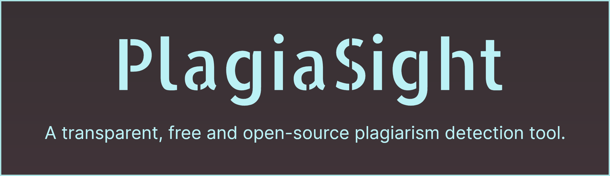

TODO : Add badges from [shields.io](https://shields.io/)

# 🤔 Why does it exist ?
Too many existing "plagiarism detection" tools just output a rather meaningless "plagiarism percentage" when the user provides them text. 

We decided to adress this issue by ourselves, by creating an app that would provide comprehensive insights by analyzing given text(s) under different perspectives, hence the existence of PlagiaSight !

Our tool aims to keep results clear and *interpretable* (so : the tool won't draw *definitive conclusions*, but rather *provide useful stats and guidance*), allowing users to use their own critical thinking rather than having the tool forcefully impose a judgment.

# 📽️ Application Demo
[insert GIFs...]

# 💡 Do you want... 
- <u>**To GET STARTED using PlagiaSight ?**</u>
<ul>

Welcome ! Please follow these **installation instructions** :
[installations instructions...]

If you have trouble executing any of these steps, don't hesitate to [**contact us**](https://github.com/LUCKYINS/PlagiarismDetectionProject/blob/main/README.md#contact-the-people-behind-the-10-version) !

<ul>
<u>**To CONTRIBUTE to the developement of PlagiaSight ?**</u>
<ul>

We're always glad to see new contributors ! Here's a roadmap to get you started : 

**1) MANIFESTO** : The #1 thing you must read before contributing is [our short **manifesto**](https://github.com/LUCKYINS/PlagiarismDetectionProject/blob/main/Resources/Manifesto/A%20Manifesto%20for%20PlagiaSight.md). 

It contains the principles guiding PlagiaSight's developement, the structure of our codebase, and much more. In essence, it is the map that will guide you when you'll browse through the project's files.

**2) FIRST PULL REQUEST** : Once you read and understood the manifesto, take a look at the codebase. [Make a Pull Request](https://github.com/LUCKYINS/PlagiarismDetectionProject/pulls) or [Open an Issue](https://github.com/LUCKYINS/PlagiarismDetectionProject/issues) if you spot any areas for improvement. 

We encourage you to contribute, even if your Pull Request gets closed without being implemented : in PlagiaSight's case, *it's better to try and fail to improve something rather than be scared to tell that something's wrong*.

**3) OTHER DOCUMENTATION** : Suggesting new features is often challenging, notably because predicting how *useful* a new feature will be is not an exact science. In order to maximize the chances to see your idea being approved, please check out the [resources that inspired us](https://github.com/LUCKYINS/PlagiarismDetectionProject/tree/main/Resources/Learning%20Material) first, and consider contributing there if it seems to align with the project's vision.

But we can't stress enough the idea that, in order to propose new features that have a chance of being useful, *you should take a peek at the documentation directly present in the project to understand all contributors' vision first*. This will help ensure your proposals are cohesive with the project's goals.

If you have questions or concerns regarding contributions, feel free to [**contact us**](https://github.com/LUCKYINS/PlagiarismDetectionProject/blob/main/README.md#contact-the-people-behind-the-10-version) !

</ul>

# 💬 Contact the people behind the 1.0 version

[https://github.com/Daniel-Dfg](https://github.com/Daniel-Dfg)

[https://github.com/LUCKYINS](https://github.com/Luckyyyin)

[https://github.com/onuriscoding](https://github.com/onuriscoding)

