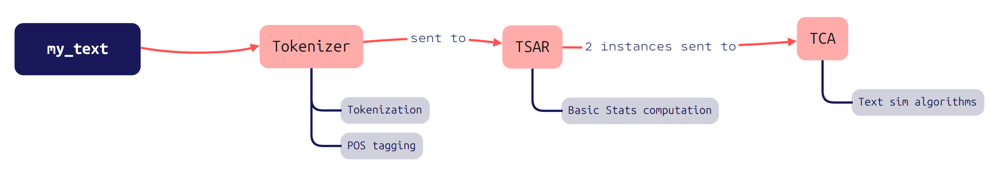
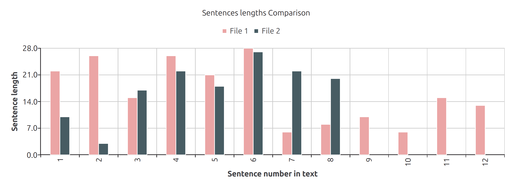
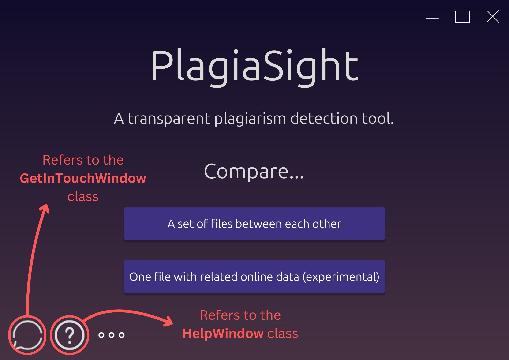
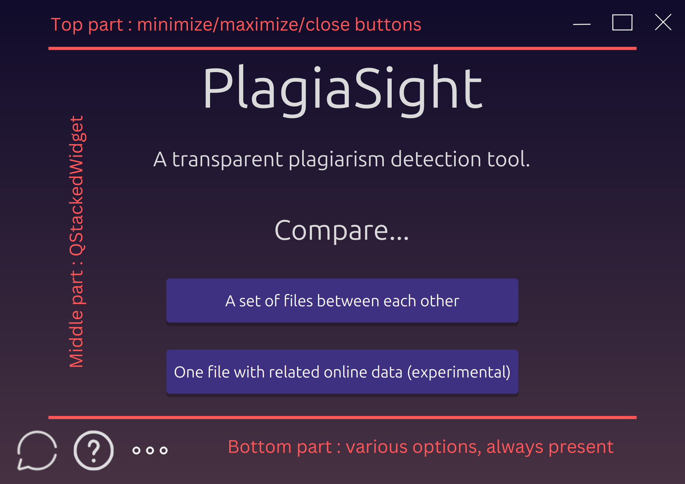

# A Manifesto for PlagiaSight

This file will depict how the project has been structured and *why* it has been made that way. It should be the first thing you read from the project's repo as a wannabe contributor. Therefore, it provides everything you need to know to understand the project, and going further to help you get started on making it evolve :)

So hop in the `/src`​ folder, and embark in your journey with us !

Note : Number between parenthesis are references to [our bibliography](https://github.com/Daniel-Dfg/PlagiaSight/blob/main/Resources/Bibliography.md) (e.g [`(1)`](https://codegnan.com/blogs/data-structure-and-algorithm-project-ideas/)​ links to the first source cited in it).
In general, we'd advise you to take a peek at our [Research resources](https://github.com/Daniel-Dfg/PlagiaSight/blob/main/Resources/Learning%20Material/ResearchResources.md) and [Inspiring projects](https://github.com/Daniel-Dfg/PlagiaSight/blob/main/Resources/Learning%20Material/InspiringProjects.md) to see what we took inspiration from.

## Brief history of the project

It just started as a small project in duo (by [Daniel-Dfg](https://github.com/Daniel-Dfg) and [LUCKYINS](https://github.com/LUCKYINS)) to learn how to work in teams using GitHub, that kept growing as our interest in Natural Language Processing did.
We feel like PlagiaSight has great potential, but since it was our first real personal project, it has its flaws. That's why we decided early to make our project free and as accessible as possible for open source contributors. Other people came before the first version was released ([onuriscoding](https://github.com/onuriscoding) and [BotEkrem](https://github.com/BotEkrem)) to give us their expertise.

‍

## The principles that guide our development

1. **Transparency**. PlagiaSight is FOSS (*Free and Open Source Software*), the results shown to the user are made to be the most explicit possible, and the mere existence of this manifesto shows that we're truly invested in explaining our design decisions and welcoming new contributors.
2. **Critical Thinking**. The goal of our app is not to *tell* people if they plagiarized or not, but rather to *provide insightful data* about their text to help them correct what they possibly did wrong. At the end of the day, it's up to the user to decide if they want to edit their text or even trust us.
    In essence, they shouldn't feel *contrived* to change things in their text, but rather to feel like changing it is the most rational decision possible.
3. **User Friendliness**. Probably a no-brainer, we aim to deliver an application to the widest range of people possible. High-schoolers, students, workers... All have a thing in common : no one is protected from plagiarizing/getting plagiarized, and therefore everyone should be able to use our app easily.
4. **Contributor Friendliness**. We consider that just allowing new contributors on our GitHub repo freely without providing them guidance doesn't mean that the project is really "open-source". That's why we're doing our best to provide detailed documentation, in order to help new contributors to get started on our project in the most seamless way possible.

## Project files explaination

### * ​`TextAnalysis.py`​

  * **Questions that lead to the creation of this file**

    1. How are you supposed to *treat* a given text ? It brings up several sub-questions :

        1. In what way(s) do you split the text ? Words, punctuations, sentences, ... ?
        2. Should we consider variations of a same word (like `eat`​ and `ate`​) to be the same ?
    2. What statistics and informations are relevant to the treated text ?
    3. Regarding the comparison process itself : what text comparision algorithms are known, and which ones should we pick ?
    4. If we want to compare our text with websites', how to know which terms to research on the web ? We must find the keywords/kerphrases from the source text first, but how to accomplish that ?
  * **General Overview**

    * This file aims to contain the "text treatment + plagiarism detection" part of the project. It includes text extraction from files, text splitting in *tokens* (more on that later) [`(6-9)`](https://github.com/Daniel-Dfg/PlagiaSight/blob/main/Resources/Bibliography.md)​, getting a few statistics from a given text and comparing two texts together using well-known text similarity algorithms [`(10, 11, 13)`](https://github.com/Daniel-Dfg/PlagiaSight/blob/main/Resources/Bibliography.md)​.
  * **Fundamental definitions** [`(2,3, 5-9, 13)`](https://github.com/Daniel-Dfg/PlagiaSight/blob/main/Resources/Bibliography.md)​

    There's no need to memorize all of this by heart, but these definitions are extremely important for understanding our project nonetheless (you'll see how when reading the file descriptions of this manifesto)

    This section doesn't put the focus on *how* all of this stuff is *concretely* implemented in PlagiaSight. For now, just focus on understanding the *core concepts* that lead this part of the project.

    * To describe the following concepts, we're going to use this text as an example :
      ​`"I ate an apple. It felt good, I liked its freshness."`​
    * A *token* is typically defined as a *traduction unit*. It's up to you to choose what you consider to be a traduction unit, e.g with which criteria you decide to split your text with.
      Example :

      * ```py
        # 't' is an abbreviation for "tokens by..."
        t_word = ["I", "ate", "an", "apple", "It", "felt", "good", ...]
        t_wordpunct = ["I", "ate", "an", "apple", ".", "It", "felt", "good", ",", ...]
        t_sentence = ["I ate an apple", "It felt good, I liked its freshness"]
        # etc...
        ```
      * So the process of *tokenizing* is naturally to split a text in tokens.
    * A *stop-word* is a very common word that usually doesn't impact its meaning much. It often serves as a *link* between two ideas, between a verb and a noun, etc.
      Examples : `as, a, an, the, for...`​
      They are usually removed from token lists where tokens are words/punctuation, as they could make keywords/keyphrases search much more difficult (since keywords/keyphrases are supposed to be *common* **and** *meaningful to represent what the text is about*).

      * After stop-words removal, our previous example becomes :

        ```py
        #stop-words removal
        t_word = ["I", "ate", "apple", "It", "felt", "good", ...] # 'an' removed
        t_wordpunct = ["I", "ate", "apple", ".", "It", "felt", "good", ",", ...]
        # etc...
        ```
    * A *syntagm* is a chain of words which forms a meaningful whole. In our project (and by convention in general), it is represented by *sequences of continuous words separated by punctuation and stop-words*.

      * Let's refine our basic set of tokens we saw earlier, by adding `t_syntagm`​ :

        ```py
        t_sentence = ["I ate an apple", "It felt good, I liked its freshness"]

        # -> text split by punctuation and stop-words
        t_syntagm = ["I ate", "apple", "It felt good", "I liked", "freshness"]
        ```
    * *Lemmatization* is the process of reducing a word to its *base* form (e.g the *lemmatized* versions of `eaten`​  and `ate`​ are both `eat`​).
      It's used to make sure that words written under different forms (like `eaten`​ and `ate`​) are actually considered to be identical. This is necessary to get accurate results for text statistics and text comparison algorithms.

      * Let's change the sets of tokens we had earlier, considering that we lemmatized them now :

        ```py
        #below : 'ate' became 'eat' and 'felt' became 'feel'
        t_word = ["I", "eat", "an", "apple", "It", "feel", "good", ...]
        t_wordpunct = ["I", "eat", "an", "apple", ".", "It", "feel", "good", ",", ...]

        #no need to lemmatize words inside tokens made of sentences
        t_sentence = ["I ate an apple", "It felt good, I liked its freshness"]

        #applied lemmatization here
        t_syntagm = ["I eat", "apple", "It feel good", "I like", "freshness"]
        ```
    * A *part of speech* (or POS) is a category to which a word is assigned in accordance with its syntactic functions. In the sentence `I ate an apple`​, `I`​'s POS is "noun", `ate`​'s POS is "verb", etc. More refined *POS tagging* (e.g assigning words to categories) exists, but we decided to stick to the most fundamental categories that exist in English for this project.
    * A $n$​ *-gram* is a group of $n$ contiguous words within a sentence. In the sentence `I ate an apple`​, the **bi**grams are : `"I ate", "ate an", "an apple"`​.
  * **Classes**

    * ​`Tokenizer`​ : tokenizes a given text (parameter `_raw_data`​) in several ways (by word, sentence, syntagm...) and POS tags every term.
    * ​`TokensStatsAndRearrangements`​ (abbreviated as `TSAR`​) : gets basic statistics from a set of tokens given as a parameter (a `Tokenizer`​ named `base`​), as well as some basic rearrangements for comparisons between texts (notably $n$-grams).
    * ​`TextsComparisonAlgorithms`​ (abbreviated as `TCA`​) : Applies fundamental algorithms to evaluate similarity between two `TokenStatsAndRearrangements`​ (like cosine similarity, $n$-grams similarity...) and stores the results.
      Works as a "on-demand" class (meaning that the results are computed only when needed) for modularity purposes.
    * ​​
      A synthetic view of what a text goes through via the aformentioned classes.
  * **Conclusion : answer to the fundamental questions seen above**

    1. How are you supposed to *treat* a given text ? It brings up several sub-questions :

        1. In what way(s) do you split the text ? Words, punctuations, sentences, ... ?

            * Well, we must split a text in several different ways in order to get the most information possible on its structure and content and make the best out of the existing text comparison algorithms.
              To put it more simply, we had to code something to *perceive* one same text in several different ways (via the multiple tokeniziations we did) to help us retrieve as much information as possible on it, without sacrificing too much runtime. That's why the `Tokenizer`​ class exists in that form.
        2. Should we consider variations of a same word (like `eat`​ and `ate`​) to be the same ?

            * Yes. Two words under different forms refer to the same set of definitions, so they should be considered to be the same for the sake of simplicity and more accurate results when computing term frequencies or similarity between texts.
              This is made via lemmatization (see the "fundamental definitions" section above).
    2. What statistics and informations are relevant to the treated text ?

        * This question has its fair share of subjectivity, and will never be completely answered. For now, we chose rather *classic* stuff like text richness, term and POS frequencies, average and median sentence length...
          However, if there's one thing we can affirm, it's that these individuals statistics must be *relevant* in one or more way(s) to the comparison process between texts. "Relevant" can mean 3 things :

          1. *Useful for other computations.*  Like, computing the term distribution frequency in a text is a fundamental step to get other, more complex statistics.
          2. *Insightful &quot;by itself&quot; to help us draw basic guidance* regarding plagiarism avoidance. An example of such a statistic is average sentence length.
          3. *Useful to help the user understand how they could've plagiarized.*  For instance, showing the sentences' lengths of 2 texts side-to-side to the user will help them *visualize* what their text (and others') look like 
              In this example (directly taken from PlagiaSight), the graph helps to show that there's a major structural difference between both texts : they're not of the same size, and the sentences' lengths also seem very dissimilar.
    3. Regarding the comparison process itself : what text comparision algorithms are known, and which ones should we pick ?

        * We're not going to write the whole list of algorithms used, but rather a set of *principles* that we followed when choosing the algorithms we wanted to put into place.
          *An ideal algorithm should be...*

          1. *Easily* *Explainable, with few prerequisites* : It's on top of this list for a reason. As *accurate* as an algorithm may be, if the user is not able to understand its results or if we're not able to explain him them in simple terms, the user will simply neglect it and our work will go to waste. (à reformuler)
          2. *Adaptable/extensible* : we should be able to edit it to make our own algorithms *based* on the original to make them correspond to our vision better.
          3. *Scalable* : certainly a no-brainer. It should work with enormous sets of data without preeventing the app from running smoothly.
        * Of course, this list is only a guidance, not an order : some algorithms we chose don't necessarily respect all of these criterias.
    4. If we want to compare our text with websites', how to know what to make our code research on the web ? We must find the keywords/kerphrases from the source text first, but how to accomplish that ?

        * Searching the web using the most common $n$-grams in the input text are a step in the right direction, but at the end of the day the RAKE algorithm [`(10, 11)`](https://github.com/Daniel-Dfg/PlagiaSight/blob/main/Resources/Bibliography.md)​ is more accurate in practice, as it is more "flexible" than $n$-grams (less strictly defined size, not only based on frequency but on a certain *score* that takes into account the actual *distribution* of the most common syntagms throughout the text).
### * ​`WebScraping.py`​

  * Our app's web scraping is still very experimental. That's why we didn't try to provide answers to the questions below : we did try to implement a solution, but there still are many things we don't know right now.
  * **Questions that lead to the creation of this file**

    * How to scrape text from the web to compare theirs with ours ?
    * How to check if web scraping is allowed on a given website ?
    * How to get the actual text from a website, since they all are so visually different and contain possibly irrelevant pieces of text (like titles of "related articles" in a newspaper) ?
### * ​`[Folder] UI_Functional`​

  * **Questions that lead our development of this**

    * Once we made the necessary computations regarding plagiarism detection, to what extent should we be *explicit* about the results we show ? Like, it is probably not a good idea to be 100% transparent and show every little statistic with explainations, so how much should we purposefully hide "less relevant" information to keep the UX fluid ?
    * Following what has just been asked, to what extent should *we* draw conclusions about potential plagiarism once we made our computations ?
      Shouldn't we let the user be critical about our results *before* telling them "You did (not) plagiarized because of this, this and this result" ?
  * ​`utilities.py`​

    * Various, one-time use classes that include stuff like the `Help`​ and `Get in touch`​ windows, a *drag &amp; drop* area to allow the user to drop their files, etc.
    * ​​

      ​
      Examples of UI utilities linked to their placement in PlagiaSight
  * `main_window.py`​

    * The main utility to setup the *skeleton* of our app.
      The main layout is given by this class : the bottom bar with action buttons, the idea of using a `QStackedWidget`​ to structure the different *phases* the user will have to go through when using the app, certain attributes that must be used by diffents parts of the `QStackedWidget`​ etc.
      ​
      Image : how the `MainWindow`​ class defines the *skeleton* of our UI (by dividing it in 3 distinct parts)
  * ​`stacked_widget_elems.py`​

    * This file defines the UI elements of each window the user will go through when using the application.
      Contains the different classes of the aforementioned `QStackedWidget`​, one per stack element.
      The logic in the classes provided here is only related to UI components themselves, not to the actual handling of the files provided by the user and the resulting text analysis.
  * ​`comparison_results.py`

    * Contains 2 classes, 2 ways to store results computed via `TextAnalysis.py`​ (href here please).
      The first one, `OneFileComparison`​, stores the data when the user chooses to compare a single file with related online data, and the second one, `CrossComparison`​, is used when the user wants to compare a set of given files between eachother.
      The way we access results stored in these classes is via the `final_results`​ attribute found in the `MainWindow`​. Checking the type of this attribute (`OneFileComparison`​ or `CrossCompare`​) allows to know what type of comparison the user wanted.
      ​​

      Note that there's two *types* of analysis - `OneFileComparison`​ and `CrossComparison`​ - but there's also two *complexities* of analysis, names "simple" and "complex".

## Conclusion

So, we haven't discussed the entirety of the project, but what you read should give you a good grasp on how the project is structured, the principles that lead it, and what we're trying to achieve. Happy coding :)

If any questions remain, or if you wish to provide feedback, [we&apos;re open to conversation](https://github.com/Daniel-Dfg/PlagiaSight/discussions) !

‍
